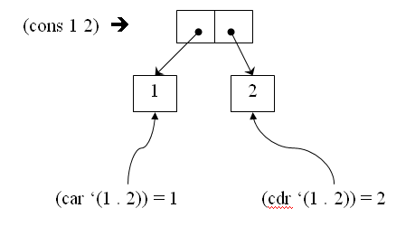
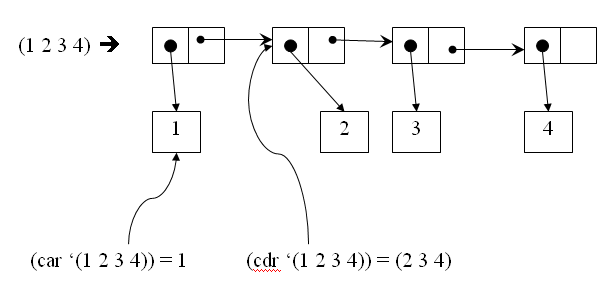
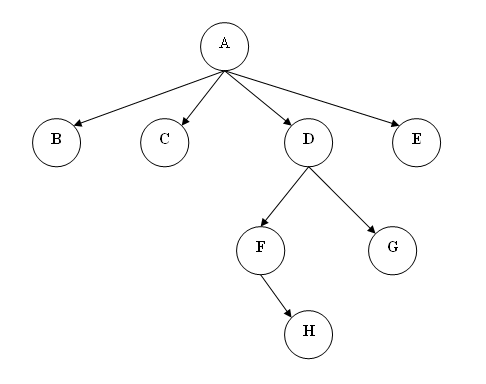
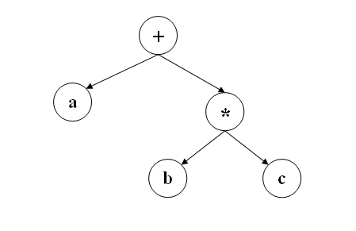

LISP前世今生
===========

### cons网络
1. Lisp中最重要的数据类型是表(List)。
2. List由被称为单元(Cell)的数据连接起来所构成的，历史上称为cons单元。
3. 一个单元包含两个值，一个是car(Contents of the Address part of Register number)，另一个叫做cdr(Contents of the Decrement part of Register number)。他们的值可以是对其他单元的引用，也可以是原子(Atom)。

### cons网络->S-Expression
S-Expression用以下规则把列表(List)转换为字符串表示形式
1. cons单元中，car的值和cdr的值用点连接，再用括号括起来。
2. cdr如果是列表的话，省略括号。
3. 末尾的cdr如果是nil，那么省略.nil。

### Lisp程序
Lisp程序是由Form(S-Expression)排列起来构成的，它通过下面的规则来进行求值。
1. 符号(Symbol)会被解释为变量，求出该变量所绑定的值。
2. 除符号以外的原子，则求出其自身的值。
3. 如果Form为表(List)，则头一个符号(Symbol)为“函数名”，表中剩余的元素为参数。
在Form中表示函数名的部分，包含函数，宏和特殊形式三种类型。

Scheme的数据类型 Scheme提供了各种通用的数据类型：整数，浮点数，复数，有理数，字符串，布尔变量，散列，数组，矢量，点对，和列表。值得一提的是点对(pair)和列表。这俩哥们儿是Scheme编程的基石。还是用例子说明比较好：
* (1 . 2)是一个点对。一个点对包含两个指针，每个指针指向一个值。我们用函数cons构造点对。比如说(cons 1 2)就构造出点对(1 . 2)。因为点对总是又函数cons构造，点对又叫做cons cell。点对左边的值可以用函数car取出来，右边的值可以由函数cdr取出来。下面是图示：

* 如果一个点对右边不是一个值，而是一个指针，指向另外一个列表，我们就得到了列表。比如下面的图表示列表(1 2 3 4)，实际上由点对构成：(1 . (2 . (3 . 4. ‘())。可以看出，列表本质是单向链表。

* 不要小看了列表。这个看似简单的数据类型的具有丰富的表达能力。比如我们可以把下面2x3的矩阵表达为((1 2 3) (4 5 6) (7 8 9)):  而下面的树也可以用列表直观表达：(A B C (D (F H) G) E)。也就是说，每个列表表示一个树或子树。列表的第一个元素是根。

* 函数 函数在Scheme里是一等公民。定义的函数可以被当成数据传递或返回。有三种定义函数的方法：
    * 用lambda操作符定义一个匿名函数。比如(lambda (x) (* 2 x))定义了一个函数，返回参数x的倍数。操作符lambda后第一个子列表是参数列表，而第二个子列表是函数定义。这和JavaScript里的匿名函数没有本质区别： function(x){return 2 * x;}
    * 用define绑定函数名：(define 1+ (lambda (x) (+ 1 x)))。这个例子定义了递加函数，并把它绑定到函数名1+上。。Scheme对函数名没有限制。事实上，Scheme对所有函数名一视同仁。规范里定义的函数没有特殊地位，我们完全可以用自己的函数定义取代。这相当于下面的JavaScript语法： var increment = function(x){return x + 1;}。
    * Scheme还提供了一条捷径，省去lambda。下面的例子用大小比较定义相等函数。函数名是same? 而参数就是后面的x和y。(define (same? x y) (not (or (> x y) (< x y))) 这样的定义方式和JavaScript里的常用函数定义方式一致。呵呵，可以看出JavaScript从哪里获得灵感的了吧？下面是等价的JavaScript定义： function isSame(x, y){ return !((x > y) || (x < y)); }

S-表达式的实质是用抽象句法树(AST)表达程序，直接省去了解析这道工 序。比如说，a+b*c解析成AST后，和下图一致。而该AST的表示不正好是(+ a (* b c))么？

更重要的是，既然程序就是句法树，程序和数据的表示就统一了。程序即数据，数据即程序。我们遍历列表修改数据。同理，我们也可以遍列类表修改程序。正是这样的统一处理带给Scheme无与伦比的威力：无论是编译时还是运行时，我们都可以修改，注入，加载，或者生成新的程序 — 这些无非是在AST里修改或添加节点而已。我们甚至可以改动或添加新的句法。

