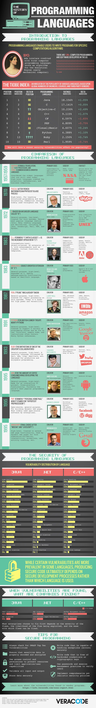

代码知多少——编程语言漫谈
=====================

程序员社区有个著名的说法：任何现代编程语言都脱胎于Smalltalk和LISP，都与这两个编程语言有着似曾相识的特性，自Smalltalk和LISP诞生以来，编程语言领域可谓大势已定了。

### 程序语言历史
* 1951 – Regional Assembly Language
* 1952 – Autocode
* 1954 – IPL (LISP语言的祖先)
* 1955 – FLOW-MATIC (COBOL语言的祖先)
* 1957 – FORTRAN (第一个编译型语言)
* 1957 – COMTRAN (COBOL语言的祖先)
* 1958 – LISP
* 1958 – ALGOL 58
* 1959 – FACT (COBOL语言的祖先)
* 1959 – COBOL
* 1959 – RPG
* 1962 – APL
* 1962 – Simula
* 1962 – SNOBOL
* 1963 – CPL (C语言的祖先)
* 1964 – BASIC
* 1964 – PL/I
* 1966 – JOSS
* 1967 – BCPL (C语言的祖先)
* 1968 – Logo
* 1969 – B (C语言的祖先)
* 1970 – Pascal
* 1970 – Forth
* 1972 – C
* 1972 – Smalltalk
* 1972 – Prolog
* 1973 – ML
* 1975 – Scheme
* 1978 – SQL
* 1980 – C++ (既有类的C语言，更名于1983年7月)
* 1983 – Ada
* 1984 – Common Lisp
* 1984 – MATLAB
* 1985 – Eiffel
* 1986 – Objective-C
* 1986 – Erlang
* 1987 – Perl
* 1988 – Tcl
* 1988 – Mathematica
* 1989 – FL
* 1990 – Haskell
* 1991 – Python
* 1991 – Visual Basic
* 1993 – Ruby
* 1993 – Lua
* 1994 – CLOS (ANSI Common Lisp的一部分)
* 1995 – Java
* 1995 – Delphi (Object Pascal)
* 1995 – JavaScript
* 1995 – PHP
* 1996 – WebDNA
* 1997 – Rebol
* 1999 – D
* 2000 – ActionScript
* 2001 – C#
* 2001 – Visual Basic .NET
* 2002 – F#
* 2003 – Groovy
* 2003 – Scala
* 2007 – Clojure
* 2009 – Go
* 2011 – Dart
* 2014 - Swift

1. 弱类型(C, JavaScript) vs 强类型(Java, Python)
2. 动态语言 vs 静态语言

### C++ template 生成代码
静态展开

### 宏编程
Read Macro

### 编程语言做什么事情
1. 内存管理
2. 文本协议（XML, JSON，Regex）
3. IO （文件系统，网络）
4. 集合的处理
5.

良好的语言应该能够以更少的代码、最小的开销表达更复 杂的想法。

### How to Write the Compiler
Lexer | Parser

~~~java
public class Token {
    public final int type;
    public final String text;
    public Token(int type, String text){
        this.type = type;
        this.text = text;
    }
    public String toString(){
        return "<'" + text + "', " + tokenNames[type] + ">";
    }
}

public class AST {
    public final Token token;
    public final List<AST> children = new ArrayList<AST>();
    public AST(Token token) {
        this.token = token;
    }
    public void addChild(AST t) {
        children.add(t);
    }
    public int getNodeType(){
        return token.type;
    }
    public boolean isNil() {
        return token == null;
    }
}

public class Symbol {
    public final String name;
    public final Type type;
    public Symbol(String name, Type type) {
        this.name = name;
        this.type = type;
    }
}

public interface Scope {
    String getScopeName();
    Scope getEnclosingScope();
    void define(Symbol sym);
    Symbol resolve(String name);
}

void cpu() {
    short bytecode = codes[ip];
    while (<<bytecode-not-halt>> && ip < codes.length) {
        ip++; //指令计数器自增，跳到下一条指令或操作数
        switch(bytecode) {
            case <<bytecode1>>: <<execute bytecode1>>; break;
            case <<bytecode2>>: <<execute bytecode2>>; break;
            case BR:
                int addr = <<将code[ip]处的四个字节转换为整型数>>；
                ip = addr
                break;
            case ICONST:
                int word = <<将code[ip]处的四个字节转换为整型数>>；
                ip += 4; //跳过操作数的四个字节
                <<将word中的数压入栈中>>;
                break;
            ...
            case <<bytecodeN>>: <<execute bytecodeN>>; break;
        }
        bytecode = codes[ip];
    }
}

(defmacro defrecord

  {:added "1.2"
   :arglists '([name [& fields] & opts+specs])}

  [name fields & opts+specs]
  (validate-fields fields)
  (let [gname name
        [interfaces methods opts] (parse-opts+specs opts+specs)
        ns-part (namespace-munge *ns*)
        classname (symbol (str ns-part "." gname))
        hinted-fields fields
        fields (vec (map #(with-meta % nil) fields))]
    `(let []
       (declare ~(symbol (str  '-> gname)))
       (declare ~(symbol (str 'map-> gname)))
       ~(emit-defrecord name gname (vec hinted-fields) (vec interfaces) methods)
       (import ~classname)
       ~(build-positional-factory gname classname fields)
       (defn ~(symbol (str 'map-> gname))
         ~(str "Factory function for class " classname ", taking a map of keywords to field values.")
         ([m#] (~(symbol (str classname "/create")) m#)))
       ~classname)))

~~~

* 类型推断

* 鸭子类型(Duck Type)，Protocol 或 Interface
Go语言中，只要有Interface中定义的方法，就算实现了该接口，赞！
Swift尽管依然需要声明Class实现某Protocol，看起来也挺别扭的，但是swift中有extension，可以在类型定义后，再声明class实现protocol，虽然繁琐点，但依然不是灵活性。

* method_missing
ruby method_missing
python __getattr__  （Python中一切对象上的一切都是属性，很灵活地添加，删除以及重定义，可以玩出各种Trick，不过在代码即数据和Ruby及Lisp还差很远。）

* Mixin
~~~ruby
module Foo
    def foo
        "foo"
    end
end
module Bar
    def bar
        "bar"
    end
end
class Demo
    include Foo, Bar
end
~~~

Python, C++支持多重继承
Java8 允许接口有默认实现

* Open Class

~~~ruby
class Numeric
    def square
        self * self
    end
end
3.square
~~~

~~~swift
extension Int {
    func square(){
        self * self
    }
}
3.square()
~~~

~~~c#
namespace ExtensionMethods {
    public static class MyExtensions {
        public static int square(this Int32 value) {
            return value * value;
        }
    }
}
using ExtensionMethods;
3.square
~~~

LISP几乎可以支持任何的编程范型
LISP-1(Scheme, Clojure) vs LISP-2(Common-LISP)，这两大家族之间主要的区别在于命名空间的工作方式。Common Lisp用不同的命名空间区分函数和变量,Scheme则不区分。

### 编程语言要素
1. 垃圾回收
2. 闭包
3. 高阶函数
4. 元编程

编程范式
1. OO
2. FP
3. 过程式
4. 声明式(Prolog)
5. 描述式
6. 组合式

Scala multiparadigm
Clojure multimethod

并发编程，约束编程, 数据流编程, 声明性编程, 分布式的编程，函数式编程，泛型编程，命令式编程，逻辑编程，元编程，面向对象编程

编程范型或编程范式（英语：Programming paradigm），（范即模范之意，范式即模式、方法），是一类典型的编程风格，是指从事软件工程的一类典型的风格（可以对照方法学）。如：函数式编程、程序编程、面向对象编程、指令式编程等等为不同的编程范型。
编程范型提供了（同时决定了）程序员对程序执行的看法。例如，在面向对象编程中，程序员认为程序是一系列相互作用的对象，而在函数式编程中一个程序会被看作是一个无状态的函数计算的串行。
正如软件工程中不同的群体会提倡不同的“方法学”一样，不同的编程语言也会提倡不同的“编程范型”。一些语言是专门为某个特定的范型设计的（如Smalltalk和Java支持面向对象编程，而Haskell和Scheme则支持函数式编程），同时还有另一些语言支持多种范型（如Ruby、Common Lisp、Python和Oz）。
很多编程范型已经被熟知他们禁止使用哪些技术，同时允许使用哪些。 例如，纯粹的函数式编程不允许有副作用；结构化编程不允许使用goto。可能是因为这个原因，新的范型常常被那些惯于较早的风格的人认为是教条主义或过分严格。然而，这样避免某些技术反而更加证明了关于程序正确性——或仅仅是理解它的行为——的法则，而不用限制程序语言的一般性。
编程范型和编程语言之间的关系可能十分复杂，由于一个编程语言可以支持多种范型。例如，C++设计时，支持过程化编程、面向对象编程以及泛型编程。然而，设计师和程序员们要考虑如何使用这些范型元素来构建一个程序。一个人可以用C++写出一个完全过程化的程序，另一个人也可以用C++写出一个纯粹的面向对象程序，甚至还有人可以写出杂揉了两种范型的程序。

* 结构化编程对比非结构化编程
* 命令式编程对比声明式编程
* 消息传递编程对比命令式编程
* 程序编程（过程式编程）对比函数式编程
* Value-level programming对比Function-level programming
* 流程驱动编程对比事件驱动编程
* 纯量编程对比阵列编程
* 基于类编程对比基于原型编程（在面向对象编程的上下文中）
* Rule-based programming对比Constraint programming（在逻辑编程的上下文中）
* 基于组件编程 (如OLE)
* 面向方面编程（如AspectJ）
* 符号式编程（如Mathematica）
* 面向表格编程（如Microsoft FoxPro）
* 管道编程（如Unix命令中的管道）
* Post-object programming
* 面向主题编程
* 自省编程或称反射编程

### Ruby
1. 核心优势 
Ruby的纯面向对象可以让你用一致的方式来处理对象。鸭子类型根据对象可提供的方法,而不是对象的继承层次,实现了更切合实际的多态设计。Ruby的模块和开放类,使程序员能把行为 紧密结合到语法上,这大大超越了类中定义的传统方法和实例变量。 
Ruby作为脚本语言或带有合理扩展需求的Web开发语言而言,可以说是相当理想的。它的生产力很强,但其中某些提高生产力的特性使得Ruby难以编译,在性能上也有所损失。
2. 不足之处 
再好的语言也不会对所有应用都表现完美。Ruby也有其局限性。下面,我们看看其中最主要 的一些局限。
    * 性能(Ruby2.0后大大有改善)
    * 并发和面向对象编程
    * 类型安全
3. 最后思考 
综上所述,Ruby的核心优势是它的语法和灵活性,根本的不足之处大概是性能,尽管应用于很多场景时,它的性能都还过得去。总之,在面向对象开发中,Ruby是一门优秀的语言。对于合适的应用,Ruby驾轻就熟。像其他工具一样,只要用它解决一组合适的问题,你就几乎不会失望。 还有,使用它的过程中最好别闭眼,不然你就会错过一个个精彩的小魔法。

### IO
1. 核心优势 
原型语言通常具有良好的可塑性,你可以改变任意对象的任意槽。Io把这种灵活性发挥到了 极致,你可以用它快速创建出你想要的语法。和Ruby一样,为了使Io具有如此强大的动态特性 而做的某些权衡,相对应的也会让它在性能上有所损失,至少在单线程的情况下是这样。Io有 强大的、现代的并发库,在很多场合成为一门优秀的并行处理语言。下面,我们就来看看Io最 擅长哪些方面。
    * 占用空间
    * 简单
    * 灵活
    * 并发 (actor, future and coroutine)
2. 不足之处 
Io值得我们喜爱的地方很多,但不尽如人意之处同样不少,获得自由和灵活是要付出代价的。 此外,由于在本书所有语言之中,Io社区是规模最小的,因此选它完成项目也要冒较大风险。下 面看看Io带来的问题都有哪些。
    * 语法
    * 社区
    * 性能
3. 最后思考 
总之,我喜欢学习Io。它语法简单,占用空间也小,这都很吸引我。我还觉得,Io就像Lisp 那样,同样具有以简单和灵活为主的哲学思想。Steve Dekorte在创造Io的过程中始终贯彻这一思 想,造就了一门类似Lisp的原型语言。我认为,Io今后仍能在艰苦条件下不断发展。像Ferris Bueller 一样,Io也有着充满光明但危机四伏的未来。

### Prolog
1. 核心优势 
Prolog适用类型广泛的问题,从航空调度到金融衍生产品。Prolog有着一条不轻松的学习曲线,不过Prolog解决的那些苛刻问题往往会让这门语言或者其他类似的语言物有所值。 
回想一下Brian Tarbox关于海豚的研究工作。他能够作出关于这个世界的简单推论,然后能够通过一个有关海豚行为的复杂推论作出了突破性的进展。他还能利用极为有限的资源,使用 Prolog找出适合的日程安排。下面是当前一些使用Prolog的活跃领域。
    * 自然语言处理
    * 游戏
    * 语义网
    * 人工智能
    * 调度
2. 不足之处 
Prolog经受住了时间的考验。不过这门语言在许多方面仍然过时了,并且它确实有一些明显 的局限。
    * 功用 
    Prolog擅长其核心领域,它专注的目标是逻辑编程。它不是一门通用的编程语言,它也有一 些有关语言设计方面的限制。
    * 超大数据集合 
    Prolog使用了一个深度优先搜索的决策树,它使用所有可能组合与规则集合相匹配,并且其 编译器对这个过程做了很好的优化。不过,这个策略需要进行大量计算,特别是当数据集规模非 常大的时候。这也迫使Prolog用户必须理解语言的工作原理以保持数据集的规模在可控范围内。
    * 混合命令式和声明式模型 
    和许多函数式语言一样,特别是那些严重依赖递归的语言,你必须理解Prolog是如何解决递 归规则的。你必须经常使用尾递归规则去完成中等规模的问题。构建一个基于小数据集但无法扩 展的Prolog应用相对容易,但必须深入理解Prolog的工作原理才能更有效地设计出在可接受的层 次上进行扩展的规则。
3. 最后思考 
当我学习完这本书中的各门编程语言时,我经常自责,感觉这些年来一直都在杀鸡用牛刀。 Prolog就是我在不断学习的过程中的一个特别深刻的例子。如果你发现一个特别适合Prolog解决 的问题,那就利用Prolog解决吧。只有这样,你才能更好地将这门基于规则的语言与其他通用语 言结合在一起使用。就像你在Ruby或Java中使用SQL一样。如果能很好地将它们结合在一起,你 很可能最终因此脱颖而出。

### Scala
1. 核心优势 
Scala优势在于提供了一种高级的编程范型,将Java环境和一些精心设计的核心特性很好地整合在一起。特别是actor、模式匹配以及XML集成,它们都是十分重要且经过精心设计的功能。 下面是各项优势及介绍。
    * 并发(actor)
    * 遗留Java的演化(Java社区)
    * DSL
    * XML
    * 桥接（面向对象到函数式）
2. 不足之处 
虽然我喜欢Scala的思想,不过我发现Scala的语法要求过多且偏学术性。虽说语法是有关个人品味的,但Scala语法负担确实比其他多数语言更重,至少对于我们这些老眼光的程序员是这样的。我也意识到了一些妥协削弱了Scala这样一个有效桥梁的价值。我只看到了三点不足,不过这些不足都是很重要的。
    * 静态类型 
        静态类型天生适合函数式编程语言,不过对于面向对象系统,Java风格的静态类型就是一场 与魔鬼的交易。有时候由于必须满足编译器的需求,而这将给开发带来更多负担。静态类型带来 的负担远远超出你的预期。对代码、语法以及程序设计的影响也是深远的。当我学会Scala时,我 发现我自己一直处在一场语法和程序设计的持续战争中。trait稍微缓解了这个负担,让我找到 了在程序员的灵活性和编译期检查需求之间的平衡点。
    * 语法 
        我真的发现Scala的语法有一些学术味道,并且看起来很吃力。是否将这个话题放到书中我一直犹豫不决,因为语法毕竟是很主观的,但是一些语法元素确实是有些令人困惑。有时,Scala保留了Java的惯例,诸如构造器。你会使用new Person而不是Person.new。而其他一些时候, Scala会引入一个新惯例,比如参数类型。在Java中,你会使用setName(String name),而Scala 则使用setName(name: String)。返回类型从Java方法声明的开头处挪到了结尾处。这些微小 的差异让我一直不得不关注语法而不是代码逻辑。这种在Scala和Java间来回切换的问题会比原本 耗费更多精力。
    * 可变性 
      当你构造一门充当桥梁角色的语言时,必须将妥协作为重要因素包含进去。Scala的一个重要的妥协就是引入了可变性。有了var,Scala就好似以某种方式打开了潘多拉的魔盒,因为可变状态可能导致各种各样的并发bug。不过如果你想将山丘上屋子中的那个特殊男孩儿带回家,那么这个妥协就是不可避免的。
3. 最后思考 
总之,我的Scala体验是喜忧参半。静态类型让我困惑,但同时我内心的Java程序员情节又让 我十分感激改进的并发模型、类型推断机制以及内置的XML支持。Scala代表了编程艺术境界上 的一次跃进。
如果我曾经在Java程序上有过较大投资,那我就会使用Scala来提升我的生产力。如果一个程序有着重要的可扩展性需求,需要使用并发时,我也会考虑使用Scala。商业上,这个科学怪人拥 有了一个良好的契机,因为它代表了一座桥梁,并且完全包容了一个重要的编程社区。

### Erlang
1. 核心优势 
发自内心地说,Erlang就是并发和容错的代名词。因为处理器的设计者想到了分布式多处理器方法,所以最新的编程技术也需要提高。Erlang的威力主要针对这一代程序员将要面对的最重要的领域。
    * 动态和可靠性 
    首先,Erlang是为可靠性而生的。Erlang的核心库久经考验,而用它写的应用程序在当今世界上也属于最可靠和最好用的一类。令人印象最为深刻的是,Erlang的设计者并没有为了获得这 种可靠性而牺牲掉使Erlang如此高效的动态类型策略。Erlang依靠的不是编译器所提供的人工的“安全网”,而是链接并发进程的能力,这样既可靠又简单。我十分惊叹于Erlang没有用到操作系 统的那些蹩脚技术,就可以轻易地构建可靠的监视器。 
    你在Erlang中发现的那些为保证可靠性而做的妥协,在我看来也非常激动人心和独一无二。 拿Java语言和虚拟机来说,它没有提供一组正确的原语,因此无法达到Erlang的那种性能和可靠性。同时,BEAM上的库也体现了Erlang的可靠性哲学,所以用它们构建可靠的分布式系统也就容易了很多。
    * 轻量级、无共享资源的进程 
    Erlang的另一处闪光点是其底层的进程模型。Erlang的进程是轻量级的,因此Erlang程序员会经常使用它们。Erlang是建立在强制要求不变性的哲学之上的,因此Erlang程序员构建的系统从 根本上就不太可能因为互相冲突而产生致命错误。Erlang拥有消息传递范型和原语,因此它可以轻易地写出带有一定的分离性的应用程序,而这在其他面向对象应用中是较为罕见的。
    * OTP——企业级的库 
    因为Erlang是在电信企业中成长起来的语言,对可用性和可靠性都有很高要求,所以可以说, 它在这个领域已有20年的开发经验。这个领域中,最主要的库是开放电信平台(Open Telecom Platform,OTP)。你可以找到帮你构建各种应用的库,包括处在监视状态下的持久进程、访问数 据库的连接、分布式应用等。OTP有整套的Web服务器以及众多工具都可用于构建电信应用。 
    这些库特别出色的一点在于:容错性、可扩展性、事务完整性、热插拔性,全都是内置特性。你不必再为它们操心。你完全可以利用这些特性构建自己的服务器进程。
    * 就让它崩溃 
    在Erlang中,处理并行进程不会有副作用,这是“就让它崩溃”策略带来的结果——你不必理会进程为什么崩溃,因为你只要重启它就好。这是一种函数式编程模型,Erlang的分布式策略 也由此得到了增强。
2. 不足之处 
Erlang的根本问题是用户群太小,这源于它根深蒂固的小众语言定位。在大多数程序员看来, 它的语法很难称得上平易近人。此外,Erlang的函数式语言范型也让它有些格格不入,这也同样 阻碍了它获得广泛应用;最后,迄今为止,最好的Erlang实现都在BEAM上,而不是Java虚拟机上。下面我们就来进一步阐述一下这几点。
    * 语法 
    和电影一样,语法也是个见仁见智的东西。除此之外,Erlang还有一些问题,就是那些不刻 意挑刺儿的人也能看到的。下面,我们就来看看其中的两个问题。 
    有一件事很有趣:Erlang最核心的优势和劣势,都源于它以Prolog为基础。对于大多数编程 者来说,Prolog是晦涩难懂的,其语法颇有些别扭的味道。如果从其他语言过渡到Prolog,一点 点语法糖无疑对降低学习难度大有帮助。 
    本章,我提到了if和case语法结构的问题。它们的语法规则是合乎逻辑的——在语句之间 用分隔符分开。然而,如果不改变标点,你就无法改变case、if或receive块的顺序,所以说这 规则又不太实用。这些语法上的限制是没有必要的。Erlang还有一些别的古怪之处,比如说,符合条件的数字数组会显示为字符串。若除掉这些问题,Erlang必将大有长进。
    * 整合 
    刚才说过,Prolog的传承者这一身份,既会带给Erlang优点,也会带来缺点。同样,不在JVM上实现Erlang也是一把双刃剑。最近,一个基于JVM的虚拟机Erjang取得了一定进展,但仍未达 到JVM上的最佳选择的水准。的确,JVM是有些拖泥带水,比如无法满足Erlang所要求的进程和线程模型等,但在JVM上实现也有诸多好处,包括各种各样的Java库以及数以十万计的可用部署服务器等宝贵财富。
3. 最后思考 
编程语言的成功是无法预测的。Erlang在市场推广上面临着严峻挑战,吸引Java程序员过来使用Lisp风格的编程范型和Prolog风格的语法绝非易事。看样子,Erlang正在慢慢地积蓄力量,因为它能在正确的时间和正确的地点解决正确的问题。

### Clojure
1. 核心优势 
成为下一个Java虚拟机上最流行的语言,Clojure属于这一目标中为数不多的竞争语言之一。 它有很多理由成为一个强有力的候选者。
    * 优秀的Lisp方言 
    Tim Bray,编程语言专家和超级博主,在Eleven Theses on Clojure一文中称Clojure是一种优秀的Lisp方言,事实上,他称Clojure为“有史以来最好的Lisp方言”。我同意Clojure是一种优秀的Lisp方言。 
    在本章中,你已经读过了Rich Hickey认为的“是什么让Clojure成为一个优秀的Lisp方言”的 讨论,概括如下。
        * 减少括号。通过开辟一丁点儿新语法,Clojure改进了可读性,这包括向量用方括号,映射表用大括号和set所使用的字符组合。
        * 生态系统。Lisp的许多方言都在一件事上有所妥协,即提供所有方言都可用的支持和类库。讽刺的是,再增加一种方言却又能改善这一问题。建于JVM之上使得Clojure可以充分受益于Java语言中大量优雅的类库集合。
        * 克制。通过实践克制并限制Clojure语法以避免宏读取器,Hickey限制了Clojure的力量,同时有效地降低了出现有害的方言碎片的可能性。
    你可能就是单纯地欣赏Lisp这门编程语言本身。那从这点说,可以把Clojure当作是一种新的Lisp来了解。从这个层面上看,Clojure是成功的。
    * 并发支持 
    Clojure的并发之路有可能彻底改变了我们设计并发系统的方式。STM由于其新颖性确实可能 会给开发者带来一定的负担,但这是头一回,语言通过检测状态改变是否发生在(受适当保护的) 函数内来保护开发者。如果不在事务里,就不能修改状态。
    * Java集成 
    Clojure有非常好的Java集成。它透明地使用了诸如字符串和数字等一些本地类型。Clojure的 亮点在于支持和JVM紧密集成,因此使得Clojure类型可以完全参与到Java应用中。很快你就会明白Clojure自身的很多部分都是在JVM上实现的。
    * 延迟计算 
    Clojure增加了强大的延迟计算特性。延迟计算可以帮助简化问题。你只是简单地体验了一把 延迟序列影响解决问题的方式。通过将计算推迟到实际需要时才执行,或者干脆避免执行,延迟 序列可以显著减少计算开销。最后,延迟问题提供了解决困难问题的又一项工具。可以用延迟序 列代替递归、迭代或者已实现的集合。
    5. 数据即代码 
    程序就是列表。像其他任何Lisp一样,你可以把数据当作代码。使用Ruby时,我注意到了用 程序写程序的价值。我认为对任何编程语言来说,这都是最重要的能力。函数式程序通过高阶函 数提供元编程。Lisp将这个想法进一步扩展,把数据当作代码求值。
2. 不足之处 
Clojure是一门坚定以通用编程语言为目标的语言。它是否真的能在JVM上获得广泛成功还有 待检验。Clojure有很多美妙的抽象,但要真正接受并安全有效地使用这些特性,需要程序员具备 很高的教育水平和天赋。以下列举出我认为的一些不足之处。
    * 前缀表达法 
    将代码表示为列表形式是Lisp最强大的特性之一,但也有代价,即前缀表示法1。典型的面 向对象语言语法与之差异极大。要调整适应前缀表示法并不容易。它需要更好的记忆力,并且要 求开发者由内向外地理解代码,而不是由外向内。有时,我觉得阅读Clojure代码迫使我过早地去 了解过多细节。好处是,Lisp语法锻炼了我的短期记忆。身处难关志在远,万千峻险终有尽。
    * 可读性 
    数据及代码的另一个成本就是多得令人压抑的括号。为人和为计算机优化完全不是一回事。 括号的位置和数量仍然是一个问题。Lisp开发者高度依赖编辑器提供的括号匹配反馈,但是工具 永远不能完全掩盖可读性问题。感谢Rich对这个问题所作出的改进,但这仍是一个问题。
    * 学习曲线 
    Clojure内容丰富,但是其学习曲线让人感到沮丧。你需要一队极有天赋和经验的人马才能用 Lisp开展工作。延迟序列、函数式编程、宏扩展,事务内存以及精密复杂的方法,所有这些都是 需要时间才能掌握的强大概念。
    * 受限的Lisp 
    所有的妥协都有其代价。由于在JVM上,Clojure限制了尾递归优化,Clojure程序员必须用可怕的recur语法。不信就试试看分别用递归和loop/recur来实现返回序列x长度的函数(size x)。
    消灭用户定义的宏读取器也是一个典型的例子。好处很明显,宏读取器被滥用时,可以导致 语言分裂。代价也很明显,你又失去一样元编程工具。
    * 亲和度 
    Ruby以及早期Java最美的方面之一就是它们作为编程语言的亲和度,这两种语言都相对简单易学。Clojure则对开发者提出了极大的要求,它包含了太多的抽象工具和概念,有时让人不堪重负。
3. 最后思考 
Clojure的优势和缺点大部分和它的力量与灵活性有关。的确,你可能需要非常努力才能学会Clojure。事实上,如果你是一名Java开发者,那你已经很努力了。你已经花掉了自己的时间去掌握Java应用层的各种抽象。你希望通过Spring或者面向方面编程获得松耦合。你只是没能从语言层面附带的灵活性中充分受益。对很多人来说,这种权衡起过作用。原谅我大胆地推测,来自并发和复杂性的新需求会继续使Java平台越来越难以为继。 
如果你需要一种极端的编程模型并且愿意付出学习语言的代价,Clojure非常合适。我认为, 如果你的团队成员受过严格的训练,并且希望扩大影响,那么Clojure是一种很有利用价值的语言。 你可以用Clojure更快地创建出更好的软件。

### Haskell
1. 核心优势 
由于Haskell采用了完全的纯函数方法,没有任何妥协,因此其优势和不足之处也都十分明显。让我们逐一来说明吧。
    * 类型系统
    如果你喜欢强类型(也许你可能不喜欢),你将喜欢上Haskell的类型系统,它召之即来,挥之即去。这个类型系统可以帮助我们避免常见错误,并且这些常见错误可以在编译阶段被捕获而不是运行阶段。不过安全性只是类型系统的一部分特性。 
    也许Haskell类型最具吸引力的地方就是,可以方便地将新行为与新类型关联到一起。你可以 从头开始创建一个高级类型。使用类型构造器和类,你甚至可以毫不费力地定义出非常复杂的类型和类,诸如monad。有了类,自定义的新类型可以利用现有的Haskell标准库。
    * 表现力 
    Haskell语言的功能异乎寻常的强大。从抽象意义上说,它拥有用于简洁地表达强大功能概念的所有东西。这些概念包括了通过丰富的函数库和功能强大的语法所表现出的行为。那些概念还 扩展到用于创建类型的数据类型中,甚至是无需过多语法即可将适当函数绑定到适当数据上的递归类型。在学术环境中,你再也找不到比Haskell更强大的函数式编程教学语言了,所有你需要的一切都在那里。
    * 编程模型的纯洁性 
    纯洁的编程模型可以从根本上改变你解决问题的方式,它会迫使你放下旧的编程范型去拥抱不同的做事方式。纯函数式编程语言赋予你可以依赖的东西。给定相同的输入,函数将总是返回 相同的结果,这个属性使得程序推导变得更加容易。有时,你可以证明出程序是对的还是错的。 你也可以避免许多因副作用而导致的错误,诸如意外的复杂性和不稳定,或者并发情况下的缓慢行为。
    * 惰性机制 
    曾几何时,用函数式编程语言编程就意味着使用递归。惰性计算机制提供一整套处理数据的新策略。你总是可以构建出表现更好的程序,并且与采用另外一种策略相比,代码行只是后者全部代码行的一小部分。
    * 学术支持 
    一些最重要、最有影响力的语言诸如Pascal成长于学术界,并受益于在学术环境下的研究和使用。作为函数式编程技术的主要教学语言,Haskell持续改善和成长。虽然它还不完全是一门主 流编程语言,但你总是可以发现一些程序员使用它完成一些重要的工作。
2. 不足之处 
到目前为止,没有哪门语言可以完美地适合所有任务。Haskell的优势互补通常也有其不足的一面。
    * 编程模型不灵活 
    作为一门纯函数编程语言,Haskell提供了一些好处,不过同时也带来一些让你头疼的事情。你可能已经注意到了使用monad编程是本书关于编程语言的最后一章的最后一节,这是理所当然 的。这些概念有着较高的能力要求。不过我们使用monad做了一些在其他语言中看起来微不足道的事情,诸如编写命令式风格的程序、处理I/O甚至是处理那些也许找到值也许没找到值的列表函数。我之前谈论其他编程语言时曾提到过,这里我要再次重申一下。虽然Haskell把一些困难的 事情变得简单了,但同时它也把一些简单的事情变得困难了。 
    特定的风格导致特定的编程范型。当构建一个逐步进行的算法时,命令式语言会工作得很好。 函数式编程语言不适合I/O密集和脚本任务。在某个人眼中的纯洁性也许在另外一个人看来更像 是一次失败的妥协。
    * 社区 
    说到妥协,你可以看到Scala和Haskell所采用方法的不同之处。虽然两者都是强类型的,但两者从根本上具备不同的设计哲学。Scala的一切都关于妥协,而Haskell的一切都关于纯洁。通过作出妥协,Scala在初始阶段就吸引了比Haskell更大的社区。虽然无法通过编程社区的大小来衡量语言的成功,但是要成功就必须拥有足够数量的支持者,并且拥有更多的用户可以提供更多的机会和社区资源。
    * 学习曲线 
    monad并非Haskell中唯一学习难度较高的概念。柯里化用于每个参数个数多于一个的函数 中。大多数基本函数具有参数化的类型,并且应用于数字的函数常常使用类型类。虽然最终回报 可能是值得的,但是你必须是一个拥有牢固理论基础的坚强程序员,这样你才能有机会在Haskell 上获得成功。
3. 最后思考 
在本书所介绍的全部函数式编程语言中,Haskell是最难学的语言。把重点放在monad和类型 系统上让学习曲线变得十分陡峭,不过一旦我掌握了其中一些关键概念,事情就变得容易许多, 它也成为了我学过的回报最高的语言。基于类型系统以及monad应用的优雅,总有一天,你会回过头来看看这门本书中最重要的语言。
Haskell还扮演着另外一个角色。其方法的纯洁性和学术关注都将会提高我们对编程的认知。 下一代最好的函数式编程程序员将会从Haskell中获得许多初步经验。

## 面向对象几个流派
* Smalltalk派是发送消息
* C++派是数据结构化
* 其他（混合等...）

## Ruby相关
Ruby DSL应用(Rails, ActiveRecord, Rake...)

## 附录
### 编程语言历史

